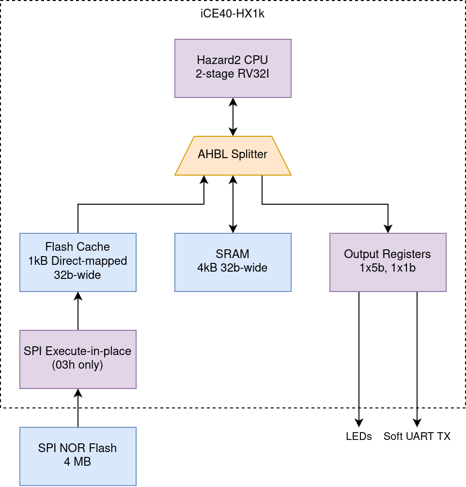

# Hazard2

Hazard2 is a smol 2-stage RV32I implementation, written in nMigen. It's a smaller brother of [Hazard5](https://github.com/wren6991/hazard5), a 5-stage RV32IMCZcsr processor which, due to its 5 stages, requires a lot of extra hardware to resolve hazards. The goal of this project is to build a relatively small and pleasing 2-stage, and to refamiliarise myself with nMigen.

The processor is built around a single AHB-Lite master port. AHB-Lite is itself a fixed 2-stage pipeline, so this is a natural fit for a 2-stage processor. Hazard2 executes most instructions at 1 CPI, with the exception of branches (1 cycle nontaken, 2 cycles taken) and load/stores (2 cycles always, no additional load-use penalty).

## AnkleSoC

AnkleSoC is a tiny SoC to support Hazard2 running on a Lattice iCEStick development board (iCE40-HX1K, 1280 LUT4s). It's the smallest SoC you can wear in public.

Currently this contains:

- A Hazard2 CPU instance
- 4kB RAM with AHB-Lite interface
- SPI flash serial execute-in-place interface
- 1kB direct-mapped cache for faster execution from flash
- Memory-mapped registers for blinking LEDs and toggling a soft UART pin
- An AHB-Lite splitter for connecting these components together

This uses 1271/1280 logic cells and 15/16 block RAMs on the HX1K. I would like to expand the peripherals a little, but this will require some LUT golf.

AnkleSoC runs at around 30 MHz (may close slightly higher or lower depending on PnR seed). The critical path is processor address setup, going through the ALU comparison and the AGU, then through address decode to the SRAM read clock enable.

nMigen made this an absolute pleasure -- for example, the `AHBLSRAM` class can accept a `bytes()` binary object for the RAM initialisation vector, and convert this to LE32 format during elaboration. The software build system does not have to know the memory geometry, and this would be the same for initialising memories with more complex geometries, like preloading a first stage bootloader into an instruction cache.

## Processor Details

> *NOTE: the rest of this readme is a bit of a brain dump*

### Branches and Instruction Fetch

Fetch addresses are generated by the AGU, in the D/X stage. Because AHB-Lite is itself a 2-stage pipeline, the address asserted on the bus for the current fetch address phase is always two instructions beyond the address of the instruction currently being decoded, assuming we are not executing a branch or jump. There is no Program Counter register, only a register for address-of-next-instruction `PC + 4`. This matches the address of the instruction currently in fetch data phase (stage F), and `PC + 8` would be the address of the instruction currently in fetch address phase. On a typical cycle the AGU asserts `PC + 8` onto the bus, and this value is registered into the `PC + 4` register to increment it by one instruction.

On a taken branch, the branch target is asserted onto the bus, and also captured in the `PC + 4` register. The next cycle is the fetch data phase for the branch target, in stage F, and a bubble in D/X. During this cycle the address phase for the instruction following the branch target also takes place, which increments the program counter by 4. Two cycles after the taken branch, the branch target instruction is in D/X, and the `PC + 4` register holds the branch target address + 4, while the AGU is likely asserting the value PC + 8 onto the bus. A nontaken branch is NOP'd in D/X stage, and the fall-through instruction enters D/X on the next cycle.

Because of how PC is stored, `AUIPC` instructions need to apply an offset of -4 in the ALU, which can be done efficiently using a carry-save term. The AGU does the same for `JAL/B*` PC offsets.

### Loads and Stores

Loads and stores take two cycles always (assuming no bus stalls). There are two reasons for this:

- Sharing of bus port between non-compressed RISC-V instructions and load/store data means two whole bus cycles are required for fetch and execution of the load/store
- Short pipeline means that load data retires to the same stage as load address is sourced from, and store data is sourced from the same stage as store address. Allowing a younger instruction into the pipe slot immediately following the load/store address phase would result in a clash on the register file `rs2` read port (store) or the `rd` write port (load).

The first can be mitigated with compressed ISA support (for 1.5 cycle amortised load/stores if `C.LW`, `C.LWSP` etc can be used), or *solved* with a second bus port, so that load/stores and instruction fetch do not share bandwidth.

The second can be solved with an additional pipe stage to keep a load/store and a following independent ALU op (e.g.) well-aligned at the register file write ports: effectively the additional stage is a dummy cycle for non-memory operations, which has a significant energy cost as these instructions all pass through this stage unnecessarily. More interestingly, specialised buffers can be inserted for load and store data, so that the timing of the memory data phase can be decoupled from the register file access. In the store case, the store buffer is filled during the store address phase, and spilled when the store data phase completes, which is no later than the end of the next store address phase, so a fill-while-full never occurs.

In the *load* case, the load buffer is filled on the cycle the memory data phase completes, *if* a younger instruction occupies the register file write port on that instruction (otherwise it *may* be written directly to the register file; this is a frequency/energy tradeoff as each use of the load buffer has an energy cost, but muxing the load into the register file adds delay to the load data path and the ALU writeback path. The cycle-for-cycle performance is the same either way). Younger intructions must then bypass out of the load result buffer until it can be spilled, and there is still a single-cycle stall on a direct load-use. The load buffer can be spilled when there is a free cycle on the register file write port, and the latest this will happen is on the next load instruction, which does not use the write port during its address phase. The upshot of this is 1 CPI for all load instructions, and a 1 cycle load-use penalty,*without* passing non-load instructions through an additional pipe stage.

These techniques have a significant cost in:

- Area: the main expense on FPGA being the additional bypass muxes
- Frequency, where additional bypassing is required: bypass muxes feature on the bus address setup path, which is likely to be critical
- Energy: this is a bit seat-of-the-pants but adding an extra pipe stage is likely to be costly for non-memory instructions which see no other benefit from it, and are just driving useless transitions.
- Aesthetics: want smol simple processor
- Brainpower in design/verification

So load/store are 2 CPI. The instruction occupies D/X for two cycles:

1. AGU generates load/store address, and address phase is asserted onto bus
2. Store data is shifted and asserted in D/X, or load data is picked, extended and captured in F. AGU generates fetch address of next-but-one instruction.

One wrinkle here is that the fetch data phase of the next instruction completes at the same time as the load/store address phase. There is no additional fetch buffering beyond the CIR, so the CIR does update between the address-phase and data-phase cycle of the load/store instruction. Enough state must be registered so that the instruction can complete successfully:

- The load data logic in stage F must know address LSBs, data size and signedness
- The ALU shifter in D/X must know address LSBs, *and* somehow needs to get `rs2` on the `rs1` ALU port, so it can be shifted (since RISC-V shift ops are `rs1 >> rs2` etc)

The store is the tricky one. To avoid muxing the entirety of the `rs1` datapath (and noting that the address setup path onto the bus will likely be longer than the data capture buffer into the regfile read ports), it seems like the best option here is to mux the CIR `rs2` field into the register file `rs1` address port, on the cycle where the next instruction drops into CIR, so that the store data is available in the right place to use the shifter on it in the next cycle.

This creates a second problem, which is how to read the registers of the next instruction for the cycle where it executes. This problem exists because an invariant was broken ("an instruction is fetched on the cycle before it executes"). The best solution I can think of right now is to mux the CIR fields back into the register file read ports, during the second cycle of the load/store. So:

- Register file `rs1` address is a mux of bus data, `CIR.rs2` (for store), and `CIR.rs1` (for instruction following load/store)
- Register file `rs2` address is a mux of bus data and `CIR.rs2` (for instruction following load/store).

### Register-register and Register-immediate Instructions

These instructions execute at 1 CPI. ALU goes brrrrrrrrrr
